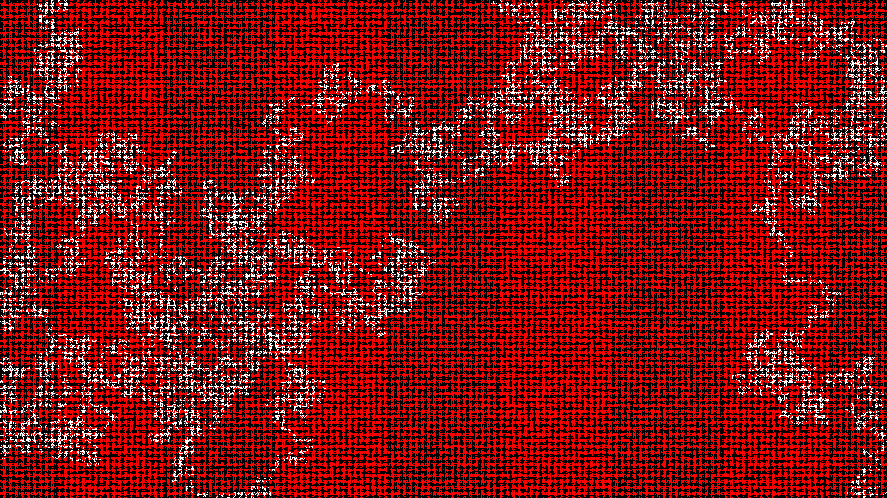

# Maze-Generatori-and-Solver
Generate and solve mazes

I use the [Recursive Backtracker](http://people.cs.ksu.edu/~ashley78/wiki.ashleycoleman.me/index.php/Recursive_Backtracker.html) algorithm to create perfect mazes.
Then I use the [Dead End Filler](http://www.astrolog.org/labyrnth/algrithm.htm#solve) algorithm to solve them.

Solved mazes:

